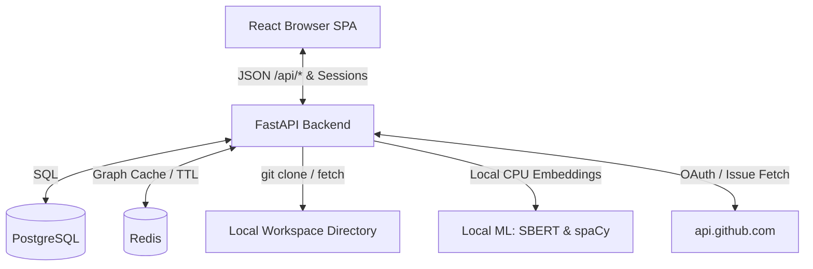
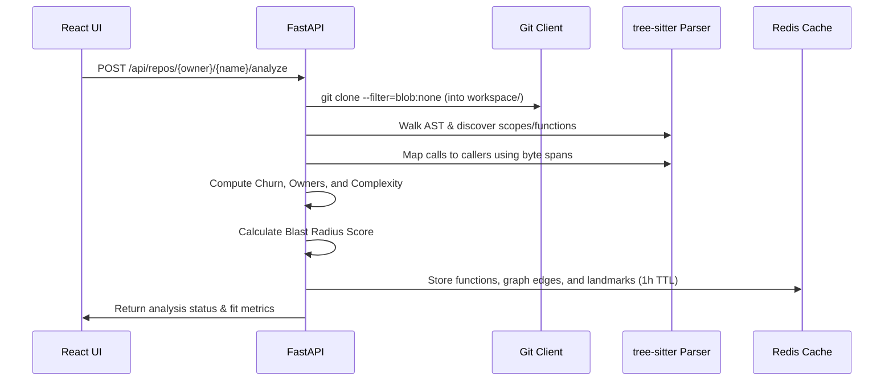

# Developer Onboarding Guide: IssueMatch AI

Welcome to **IssueMatch AI**! This guide is designed to get you from a fresh clone to writing code, running tests, and understanding every core technical concept, decision, architecture, and pipeline in the system.

---

## 1. Project Overview & Mission

IssueMatch AI matches developers to open-source GitHub issues while programmatically proving the risk of modifying the affected code. 

### The Core Guarantees
> [!IMPORTANT]
> **Zero LLM dependencies in the request path**: We believe statistical LLMs are too slow, expensive, and prone to hallucinations to answer safety-critical questions like *"Is this code safe to edit?"*. Every metric, explanation, and recommendation shown is calculated deterministically via local AST parsing, git log history, or in-process local CPU vector embedding.
>
> **Falsifiable Network Isolation**: Outbound traffic is locked down. Every network request goes through a single client that enforces a strict allowlist. A live **Trust Panel** widget in the UI displays every host contacted, allowing users to verify that we only talk to `api.github.com`.

---

## 2. Technical Stack & Requirements

### Languages & Core Libraries
- **Frontend**: React 19, TypeScript, Vite, Tailwind CSS v4, React Query, Lucide React (icons), Recharts (Blast Radius Map radial nodes).
- **Backend**: FastAPI (Python 3.11), Uvicorn, SQLAlchemy (Async), Alembic, Pydantic v2 (Settings).
- **Parsers**: `tree-sitter` (grammars for Python, JavaScript, TypeScript, TSX).
- **Local Machine Learning**:
  - **Sentence Transformers** (`all-MiniLM-L6-v2`): Runs locally in-process on CPU via PyTorch to generate vector embeddings.
  - **spaCy** (`en_core_web_sm`): Local natural language parsing for SVO (Subject-Verb-Object) extraction.
- **Data Stores**:
  - **PostgreSQL 16**: User accounts and skill profiles.
  - **Redis 7**: Cache for parsed AST graphs, analysis results, and git churn data (1-hour TTL).

---

## 3. Architecture Overview

### System Layout



### Directory Reference
- `backend/app/core/`: Application settings, encryption keys, and cookie configuration.
- `backend/app/db/`: PostgreSQL database schema models and async database connection pool.
- `backend/app/api/routes/`: FastAPI routes (auth, analyze, recommendations, blast_map, trust, users, health).
- `backend/app/services/`: Pure python services housing the business logic (parsing, Call Graphs, metrics, etc.).
- `backend/migrations/`: Database schema version control (Alembic migrations).
- `backend/tests/`: Comprehensive Pytest suite.
- `backend/workspace/`: Temporary clone locations for analyzed repositories (gitignored).
- `frontend/src/components/`: Modular React components. `RepoWorkspace.tsx` is the primary dashboard interface.
- `frontend/src/lib/`: Typed fetch wrappers (`api.ts`) and user authentication status check hooks (`session.ts`).

---

## 4. First-Time Setup & Everyday Loop

Follow these steps to spin up the local development sandbox:

### Step 1: Register a GitHub OAuth Application
1. Go to **GitHub → Settings → Developer Settings → OAuth Apps → New OAuth App**.
2. Set the following fields:
   - **Homepage URL**: `http://localhost:5173`
   - **Authorization callback URL**: `http://localhost:8010/api/auth/callback`
3. Generate and note down the **Client ID** and **Client Secret**.

### Step 2: Configure Environment Variables
Copy the template env file:
```bash
cp backend/.env.example backend/.env
```

Open `backend/.env` and configure:
```ini
GITHUB_CLIENT_ID=your_oauth_client_id
GITHUB_CLIENT_SECRET=your_oauth_client_secret
GITHUB_OAUTH_REDIRECT_URI=http://localhost:8010/api/auth/callback

# Generate signed session secret: python -c "import secrets; print(secrets.token_urlsafe(32))"
SESSION_SECRET_KEY=your_urlsafe_session_secret

# Generate Fernet encryption key: python -c "from cryptography.fernet import Fernet; print(Fernet.generate_key().decode())"
TOKEN_ENCRYPTION_KEY=your_fernet_encryption_key

ENVIRONMENT=development
FRONTEND_URL=http://localhost:5173
```

### Step 3: Launch Containers & Run Migrations
```bash
# Build and run backend, frontend, postgres, and redis services
docker compose up -d --build

# Run Alembic migrations to initialize PostgreSQL database schemas
docker compose exec backend alembic upgrade head
```

Open `http://localhost:5173` in your browser.

> [!TIP]
> **Applying changes**: Both `backend/` and `frontend/` directories are bind-mounted into the containers. Modifying files on the host system triggers hot reloading automatically.
>
> If you edit environment variables or `requirements.txt`/`package.json`, trigger a rebuild:
> ```bash
> docker compose up -d --build --force-recreate backend
> ```

---

## 5. Core Pipelines & Mathematical Formulas

The system revolves around two main data flow engines: Repository Analysis and Issue Recommendation.

### Pipeline A: AST Code Analysis


### Pipeline B: Semantic Issue Ranking
When a user clicks on a repo's issue tab:
1. **Fetch**: FastAPI fetches open issues from GitHub.
2. **Embedding**: We compute 384-dimensional dense vectors for both the issue title/body text and the developer's skill string using our local sentence transformer model.
3. **Similarity**: Cosine similarity aligns the vectors, generating a score between `-1.0` and `1.0` (typically `0.0` to `1.0` in text context).
4. **Keyword Check**: TF-IDF vectors isolate exact technical keyword overlaps (e.g. `redis`, `asyncpg`) to explain the recommendation.
5. **Code Resolution**: We match backtick quotes (e.g. \`serializer.dumps\`) against the cached AST functions to link the issue directly to code metrics.

---

### Formulas & Indices

#### 1. Blast Radius Score ($B_R$)
Combines structural complexity, frequency of edits, and the presence of safety nets. Calculated per function and normalized between `0.0` and `1.0`:

$$B_R = 0.35 \times \text{FanIn}_{\text{norm}} + 0.30 \times \text{CC}_{\text{norm}} + 0.20 \times (1 - \text{HasTest}) + 0.15 \times \text{Churn}_{\text{norm}}$$

- **FanIn**: Number of functions calling this function directly across the repo.
- **CC (Cyclomatic Complexity)**: Decision nodes counted in AST (branches, loops, boolean operators).
- **HasTest**: Binary value (`1` if a matching test exists in the test directory, `0` otherwise).
- **Churn**: Commit frequency weighted by recency: $\frac{\text{commits}}{\text{days} + 1}$.

#### 2. Readiness Rating ($R_C$)
Measures repo-level fit for a developer, combining skill overlap and code complexity:

$$R_C = 0.40 \times \text{SkillOverlap} + 0.35 \times (1 - \text{AvgBlastRadius}) + 0.25 \times \frac{1}{1 + \text{GapSize}}$$

- **SkillOverlap**: Percentage of required package manifest tags matched in the user's profile.
- **GapSize**: Absolute count of missing languages or tools detected.

---

## 6. Security Boundaries & Guardrails

We enforce security at the architectural level:

- **Directory Traversal Mitigation**: To prevent malicious path injects (e.g., `owner/../../etc/passwd`), `repo_fetcher.py` enforces a strict allowlist regex validation (`^[A-Za-z0-9._-]+$`) on both target owner and name segments before launching a child git process:
  ```python
  owner, sep, name = full_name.partition("/")
  if not (sep and _is_safe_segment(owner) and _is_safe_segment(name)):
      raise RepoFetchError("Not a valid owner/repo identifier")
  ```
- **Token Protection at Rest**: Access tokens obtained during GitHub OAuth are encrypted with Fernet (AES-128 in CBC mode with HMAC-SHA256 signature verification) using `TOKEN_ENCRYPTION_KEY` before saving to PostgreSQL.
- **Secure Cookie Flags**: Session cookies signed with `itsdangerous` automatically enable the `secure=True` flag outside the local development sandbox by checking `ENVIRONMENT != "development"`.
- **Sandbox Network Auditing**: `github_client.py` routes all requests through `_request`, verifying hosts against a strict allowlist (`api.github.com` only). A live logs endpoint exposes this log directly to the frontend's trust verification widget.

---

## 7. Testing & Quality Assurance

We maintain a zero-mock policy on business logic: every test runs against real temporary repositories, real Redis caches, or real tree-sitter AST outputs.

### Running Pytest
Run the test suite inside the backend container:
```bash
docker compose exec backend python -m pytest tests/ --ignore=workspace
```

> [!CAUTION]
> **Always append `--ignore=workspace`**. The `backend/workspace/` folder accumulates cloned repositories from analysis requests. Leaving this flag out causes Pytest to try parsing files inside cloned repos, breaking execution due to encoding errors or recursive file loops.

---

## 8. Extension Guide

### Adding a New Programming Language
To extend the static parser to support a new language:
1. Add the tree-sitter grammar package dependency to `backend/requirements.txt`.
2. In `backend/app/services/parsing/languages.py`:
   - Create `iter_<lang>_functions(root, source)` yielding `(function_name, AST_node)`.
   - Create `iter_<lang>_calls(root, source, function_spans)` tracking call sites and yielding `(caller_id_or_None, callee_name)`.
   - Define `is_decision(node, source) -> bool` mapping decision tokens for cyclomatic complexity.
   - Register a `LanguageSpec` in the `LANGUAGES` mapping containing your target extensions.
3. Write matching grammar tests under `backend/tests/` to assert definition discovery, caller mapping, and complexity.

### Adding a New Metric
1. Write a pure function in a new or existing file under `backend/app/services/` that maps a metric to `dict[function_id, float]`.
2. Integrate it inside `analyze_repo` in `backend/app/services/analysis.py`.
3. Configure the metric's weighting constant inside `backend/app/services/blast_radius.py` and ensure the sum of weights remains exactly `1.0`.
